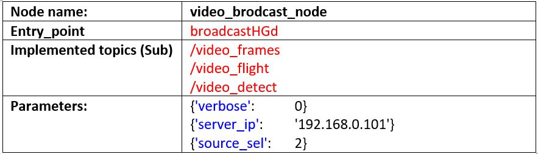
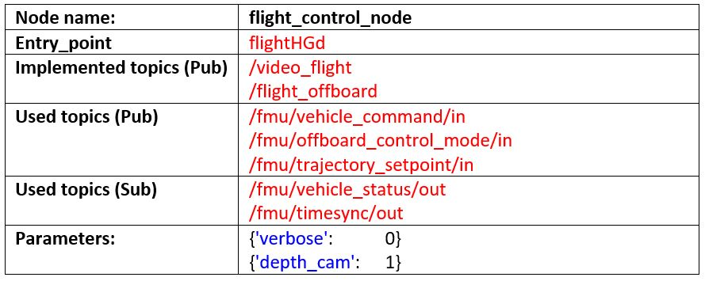
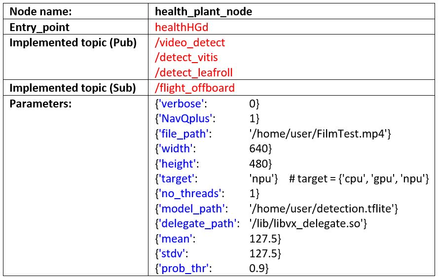

# NXP HoverGames3: Land, Sky, Food Supply

These are the codes developed in the frame of NXP HoverGames Challenge 3: Land, Sky, Food Supply

## Overview

In this project, I have developed an intelligent system to assess the healthiness of vines through the characteristics resulting from the analysis of the vine leaves (texture, shape, or color). 

## Components

### Hardware components:

- 1 x **NXP KIT-HGDRONEK66** (carbon frame kit, BLDC motors, ESCs, PDB, propellers, etc.)
- 1 x **NXP RDDRONE-FMUK66** - flight management unit
- 1 x **NXP 8MPNavQ-4GB-XE** - an embedded computer (i.MX 8M Plus Quad with a Neural Processing Unit, 4GB LPDDR4, WiFi/BT)
- 1 x **Google Coral camera**
- 1 x **NXP HGD-TELEM433** - 433Mhz Telemetry Radio 
- 1 x **Intel RealSense D435i**
- 1 x 4S 5000 mAh battery (3S can work too)

### Software components

#### Official support software

- **PX4** - an open source flight control software for drones and other unmanned vehicles
- **PX4 QGroundControl** - Ground Control Station for the MAVLink protocol

#### Main software components developed for NXP HoverGames Challenge 3

The components that implement the software part of the **agriHoverGames** drone were developed as a single **ROS 2** package consisting of 4 files written in Python:
1. videoPub.py:

2. videoWiFibroadcast.py

3. flightControl.py and

4. healthPlant.py 

Each Python file incorporates a node of the application, as was presented above: (1) `video_publisher_node` in videoPub.py, (2) video_brodcast_node in videoWiFibroadcast.py, (3) `flight_control_node` in flightControl.py, and (4)  `health_plant_node` in healthPlant.py. Communication and synchronization between nodes are done through topics.

The healthPlant.py file implements the detection system that detects abnormal leaves based on the TensorFlow Lite model obtained. First, the detection system starts the detection process when the agriHoverGames drone is in Offboard mode. The `health_plant_node` takes note of this fact from the `flight_control_node node` through the /flight_offboard topic published by `flight_control_node`, and in this mode, the detection process starts. The `health_plant_node` publishes two topics related to the detection process: /detect_vitis and /detect_leafroll. These two topics post at each second the area of lives for each class detected in the previous second and at every 10 seconds (as a negative number) the total area of diseased leaves from the point when the system was set to Offboard mode. When the agriHoverGames drone is not in the Offboard mode will publish (as positive numbers) every 5 seconds the area of the affected leaves discovered when the drone was in Offboard mode.

The `flight_control_node node` is connected to the PX4 autopilot, being able to control agriHoverGames based on velocity and position modes. It also interrogates the drone status being able to know the status of the drone at each moment. This node can arm, disarm, takeoff, land etc., the drone accordingly with necessities resulting from the offboard control.

Each of the following nodes `video_publisher_node`, `flight_control_node`, and `health_plant_node` has a specific topic (/video_frames, /video_flight, and video_detect) used to publish images in the case when the associated verbose parameter has a value equal to one. Mainly because the NavQ Plus development board is headless (at least in my case), it is required from time to time or when the debug operation takes place to see the results of the internal processing. Therefore, in such cases, these nodes will publish images with the internal processing state.

The `video_brodcast_node` can subscribe to a specific image topic (/video_frames, /video_flight, and /video_detect) – based on source_sel parameter (0 for /video_frames, 1 for /video_flight and 2 for /video_detect) and stream the images to the ZeroMQ video server through the ZeroMQ streaming protocol based on the WiFi link. To have a real-time solution, the images obtained from a specific topic are compressed to the jpeg format and streamed. The compression factor can vary between 0 to 100. A higher value represents a more quality image.
